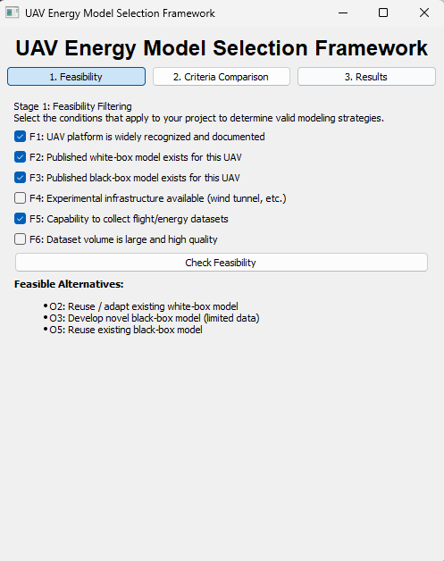
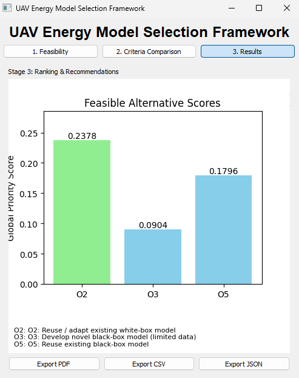

# UAV Energy Model Selection Framework (AHP-Enhanced)

[](https://www.riverbankcomputing.com/software/pyqt/) [](https://numpy.org/) [](https://matplotlib.org/) [](https://pandas.pydata.org/) [](https://www.reportlab.com/) [](https://opensource.org/licenses/MIT)

This repository implements a **A Two-Stage Decision Framework** for selecting energy consumption models in UAV (Unmanned Aerial Vehicle) simulations. The framework applies a two-stage process:
1.  **Feasibility Filtering**: Determines valid modeling strategies based on available resources and data.
2.  **AHP-Based Ranking**: Ranks feasible strategies using the Analytic Hierarchy Process (AHP) based on user-defined criteria preferences.

## Features
- **Stage 1: Feasibility Check**: Interactive checklist to filter out impossible modeling paths based on 6 key indicators ($F_1 - F_6$).
- **Stage 2: Criteria Comparison**: 
    - 4x4 AHP Matrix input with Saaty's 1-9 scale to weigh Accuracy, Interpretability, Cost/Time, and Customization.
    - **Smart Fill**: Automatically infers missing values based on transitivity logic (e.g., if A>B and B>C, suggests A>C).
    - **Consistency Reporting**: Identifies specific inconsistent judgments and suggests corrections to lower the Consistency Ratio (CR).
- **Stage 3: Results & Visualization**:
    - Real-time consistency check (CR) for your judgments.
    - Dynamic ranking of the 5 alternative modeling strategies ($O_1 - O_5$).
    - Interactive Bar Charts showing global priority scores.
- **Export Options**: Save reports as PDF, CSV, or JSON.
- **Paper Alignment**: The framework's core logic (feasibility rules and alternative local priorities) is strictly aligned with the quantitative framework defined in the associated research paper.

## Installation
1.  **Prerequisites**: Python 3.8+.
2.  **Dependencies**: Install via pip:
    ```bash
    pip install -r requirements.txt
    ```
    Key libraries: `PyQt5`, `numpy`, `matplotlib`, `pandas`, `reportlab`.

3.  Clone the repo:
    ```bash
    git clone https://github.com/Bayaola/UAV-Energy-Model-Selection.git
    cd UAV-Energy-Model-Selection-Framework
    ```

## Usage
1.  Run the application:
    ```bash
    python main.py
    ```

## Step-by-Step Tutorial

### Step 1: Feasibility Analysis
Select the indicators ($F_1 - F_6$) that match your project's available resources and data.
- **F1-F2**: Related to White-Box models (requiring physical parameters).
- **F3-F4**: Related to development resources (time/cost).
- **F5-F6**: Related to Black-Box models (requiring flight data).

Click **"Check Feasibility"** to proceed. Only models that fit your constraints will be considered in the next stage.



### Step 2: Criteria Weighting (AHP)
Compare the relative importance of the 4 criteria: **Accuracy**, **Interpretability**, **Development Cost**, and **Customization**.
- Use the dropdowns to set pairwise comparisons (e.g., Accuracy is "Strongly more important" than Cost = 5).
- **Smart Fill**: Enable this to automatically infer consistent values for the rest of the matrix.
- **Consistency Check**: The system calculates a Consistency Ratio (CR). Keep CR < 0.1 for valid results. If CR is high, inconsistent cells will be highlighted in red.


### Step 3: Results & Export
View the final ranking of the energy modeling strategies ($O_1 - O_5$).
- The **Global Score** combines your criteria weights with the model's inherent performance.
- Use the **Export** buttons to save a detailed PDF report, or export raw data to CSV/JSON.



## Alternatives ($O_j$)
- **O1**: Develop Novel White-Box Model
- **O2**: Reuse/Adapt Existing White-Box Model
- **O3**: Develop Novel Black-Box Model (Regression)
- **O4**: Develop Novel Black-Box Model (ML/Large Data)
- **O5**: Reuse Existing Black-Box Model

## Contributing
Fork, PRs welcome! Report issues for weights/criteria tweaks.
## Credits
- Developed by Bayaola & al. (2026).
- More details: N/A.

## License
MIT License – see [LICENSE](LICENSE) file.
